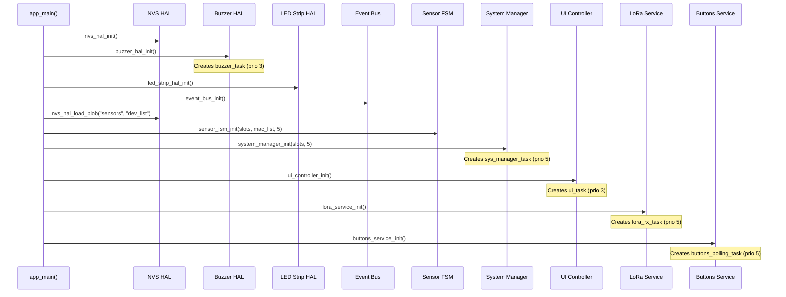

# Water Sentry Gateway — State Machine Diagram

## Sensor Slot FSM (per slot, 5 independent instances)

```mermaid
stateDiagram-v2
    direction TB

    [*] --> EMPTY : Power on / no saved MAC

    state EMPTY {
        [*] --> Idle_Empty
    }
    note right of EMPTY : LED: OFF\nBuzzer: SILENT

    state PAIRING {
        [*] --> Waiting
    }
    note right of PAIRING : LED: BLUE\nBuzzer: SILENT\nTimeout: 60 sec

    state OK {
        [*] --> Normal
    }
    note right of OK : LED: GREEN\nBuzzer: SILENT\nPing → brief blink-off (100ms)

    state OFFLINE {
        [*] --> Lost
    }
    note right of OFFLINE : LED: YELLOW\nBuzzer: WARNING (beep)\nShort press → ack buzzer

    state ALARM {
        [*] --> WaterDetected
    }
    note right of ALARM : LED: RED\nBuzzer: ALARM (slow beep)

    %% Transitions from EMPTY
    EMPTY --> PAIRING : Short press button\n(empty slot)

    %% Transitions from PAIRING
    PAIRING --> OK : Pairing packet received\nfrom sensor
    PAIRING --> EMPTY : Short press (cancel)\nOR 60s timeout\n→ mac_addr cleared, NVS saved

    %% Transitions from OK
    OK --> ALARM : Water alarm packet\n(STATUS_BIT_ALARM_WATER)
    OK --> OFFLINE : No packets for\nSENSOR_TIMEOUT_MS (30s)
    OK --> PAIRING : Long press (≥3s)\n→ mac_addr cleared, NVS saved

    %% Transitions from OFFLINE
    OFFLINE --> OK : Any packet received\nfrom sensor
    OFFLINE --> EMPTY : Long press (≥3s)\n→ mac_addr cleared, NVS saved\n(forced in system_manager)

    %% Transitions from ALARM
    ALARM --> OK : Ping packet (no alarm)\nfrom sensor
    ALARM --> OFFLINE : No packets for\nSENSOR_TIMEOUT_MS (30s)
```

### Valid transition matrix (from `sensor_fsm.c`)

| From ↓ \ To → | EMPTY | PAIRING | OK | OFFLINE | ALARM |
|:---|:---:|:---:|:---:|:---:|:---:|
| **EMPTY** | — | ✅ | — | — | — |
| **PAIRING** | ✅ | — | ✅ | — | — |
| **OK** | — | ✅ | — | ✅ | ✅ |
| **OFFLINE** | ✅ | — | ✅ | — | — |
| **ALARM** | — | — | ✅ | ✅ | — |

> **Note:** `OFFLINE → PAIRING` is **not** in `sensor_fsm.c`'s `is_valid_transition()`.  
> It is forced directly in `system_manager.c` (long press handler) by clearing `mac_addr` and setting `state = SLOT_PAIRING` manually, bypassing `set_state()`.

---

## Button Event Flow

```mermaid
flowchart TD
    Press[Button Press\n(hardware-debounced)] --> HoldCheck{Held ≥ 3000ms?}

    HoldCheck -->|Yes| LongPress[EVENT_BTN_LONG_PRESS]
    HoldCheck -->|No, released| ShortPress[EVENT_BTN_PAIR_PRESSED]

    ShortPress --> SlotState{Slot State?}
    SlotState -->|EMPTY| StartPairing[Enter PAIRING]
    SlotState -->|PAIRING| CancelPairing[Cancel → EMPTY\nSave NVS]
    SlotState -->|OFFLINE| AckBuzzer[Acknowledge buzzer\noffline_acked = true]
    SlotState -->|OK / ALARM| Ignore[Do nothing]

    LongPress --> BoundCheck{Slot State?}
    BoundCheck -->|OK / ALARM / OFFLINE| ForcePairing[Clear mac_addr\nEnter PAIRING\nSave NVS]
    BoundCheck -->|EMPTY / PAIRING| Ignore2[Do nothing]
```

### Button timing constants (from `app_config.h`)

| Parameter | Value | Description |
|-----------|-------|-------------|
| `BUTTON_POLL_MS` | 20 ms | ADC polling interval |
| Long press threshold | 3000 ms | Hardcoded in `buttons_service.c` |

---

## System Boot Sequence



---

## System Architecture — Event Flow

```mermaid
flowchart LR
    subgraph HAL["Hardware Abstraction Layer"]
        LORA_HAL[LoRa HAL\nSX1278 SPI]
        BTN_HAL[Buttons HAL\nADC read]
        LED_HAL[LED Strip HAL\nRMT driver]
        BUZZ_HAL[Buzzer HAL\nGPIO + timer\n<buzzer_task>]
        NVS_HAL[NVS HAL\nFlash storage]
    end

    subgraph SERVICES["Service Layer"]
        LORA_SVC[LoRa Service\nFreeRTOS task\n<lora_rx_task>]
        BTN_SVC[Buttons Service\nFreeRTOS task\n<buttons_polling_task>\n+ debounce + long press]
        UI_CTRL[UI Controller\nFreeRTOS task\n<ui_task> 50ms\nLED + Buzzer]
        EV_BUS{{Event Bus\nFreeRTOS queue}}
        SYS_MGR[System Manager\nFreeRTOS task\n<sys_manager_task> 1s\nOrchestrator]
        FSM[Sensor FSM\nPure logic\n5 slots]
    end

    LORA_HAL -->|lora_rx_packet_t| LORA_SVC
    BTN_HAL -->|uint8_t raw| BTN_SVC

    LORA_SVC -->|EVENT_LORA_PACKET_RX| EV_BUS
    BTN_SVC -->|EVENT_BTN_PAIR_PRESSED| EV_BUS
    BTN_SVC -->|EVENT_BTN_LONG_PRESS| EV_BUS

    EV_BUS -->|event_t| SYS_MGR
    SYS_MGR -->|read/write state| FSM
    SYS_MGR -->|save/load| NVS_HAL

    FSM -->|sensor_slot_t[5]| UI_CTRL
    UI_CTRL -->|led_color_t[5]| LED_HAL
    UI_CTRL -->|buzzer_state_t| BUZZ_HAL
```

---

## Event Bus — Message Catalog

| Event Type | Producer | Consumer | Payload |
|------------|----------|----------|---------|
| `EVENT_BTN_PAIR_PRESSED` | Buttons Service | System Manager | `button_num` (1..5) |
| `EVENT_BTN_LONG_PRESS` | Buttons Service | System Manager | `button_num` (1..5) |
| `EVENT_LORA_PACKET_RX` | LoRa Service | System Manager | `mac_addr`, `packet_type` (status bits) |
| `EVENT_PERIODIC_TICK` | System Manager (self) | System Manager | — (generated on queue timeout) |
| `EVENT_PAIRING_TIMEOUT` | System Manager (self) | System Manager | — (generated on queue timeout) |

---

## LED Color Map

| State | Red | Green | Blue | Visual |
|-------|-----|-------|------|--------|
| EMPTY | 0 | 0 | 0 | ⚫ Off |
| PAIRING | 0 | 0 | 255 | 🔵 Blue |
| OK | 0 | 255 | 0 | 🟢 Green |
| OK (ping blink) | 0 | 0 | 0 | ⚫ Brief off (100ms) |
| OFFLINE | 0 | 255 | 255 | 🟡 Yellow (Green+Blue) |
| ALARM | 255 | 0 | 0 | 🔴 Red |

---

## Buzzer Patterns

| Condition | Pattern | Code Constant | Meaning |
|-----------|---------|---------------|---------|
| Any ALARM slot | 1000ms ON / 1000ms OFF | `BUZZER_STATE_ALARM` | Water leak detected |
| Unacked OFFLINE slot(s) | 200ms ON / 200ms OFF | `BUZZER_STATE_WARNING` | Sensor connection lost |
| All OFFLINE acked / no issues | OFF (always low) | `BUZZER_STATE_SILENCED` | Normal operation |

### Buzzer state priority (in `ui_controller.c`)

```
has_alarm → BUZZER_STATE_ALARM       (highest)
has_unacked_offline → BUZZER_STATE_WARNING
else → BUZZER_STATE_SILENCED         (lowest)
```

---

## Task List (FreeRTOS)

| Task | Stack | Priority | Period | WDT | Created by |
|------|-------|----------|--------|-----|------------|
| `lora_rx_task` | 3072 | 5 | ~10ms (poll) | ✅ | `lora_service_init()` |
| `buttons_polling_task` | 3072 | 5 | 20ms | ✅ | `buttons_service_init()` |
| `sys_manager_task` | 4096 | 5 | 1s (event timeout) | ✅ | `system_manager_init()` |
| `ui_task` | 3072 | 3 | 50ms | ✅ | `ui_controller_init()` |
| `buzzer_task` | 3072 | 3 | varies (100ms/400ms/2000ms) | ✅ | `buzzer_hal_init()` |

### Task periods for buzzer_task (from `buzzer_hal.c`)

| Buzzer State | Cycle | vTaskDelay |
|-------------|-------|------------|
| `BUZZER_STATE_SILENCED` | OFF → wait 100ms → repeat | 100ms |
| `BUZZER_STATE_WARNING` | ON 200ms → OFF 200ms → repeat | 200ms |
| `BUZZER_STATE_ALARM` | ON 1000ms → OFF 1000ms → repeat | 1000ms |

---

## Configuration Constants (from `app_config.h`)

| Constant | Value | Description |
|----------|-------|-------------|
| `MAX_SENSORS` | 5 | Number of sensor slots |
| `EVENT_QUEUE_LENGTH` | 10 | System event queue capacity |
| `LORA_RX_QUEUE_LENGTH` | 20 | LoRa RX packet queue capacity |
| `BUTTON_POLL_MS` | 20 ms | ADC polling interval |
| `SENSOR_TIMEOUT_MS` | 30000 ms (30s) | Sensor considered offline after this |
| `PAIRING_TIMEOUT_MS` | 60000 ms (60s) | Pairing mode auto-cancel |