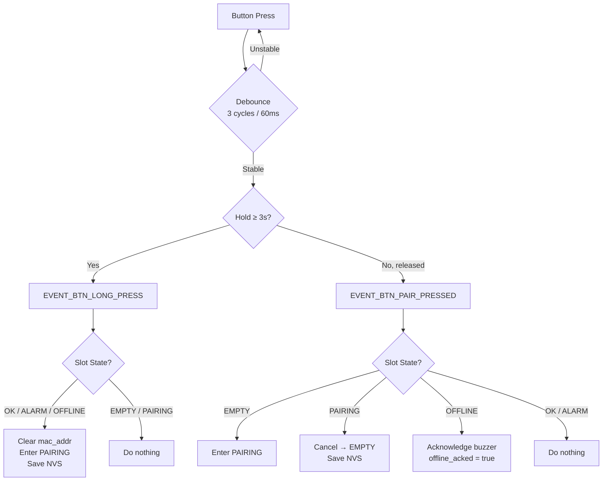

# Water Sentry Gateway — State Machine Diagram

## Sensor Slot FSM (per slot, 5 independent instances)

```mermaid
stateDiagram-v2
    direction TB

    [*] --> EMPTY : Power on / no saved MAC

    state EMPTY {
        [*] --> Idle_Empty
        note right of Idle_Empty : LED: OFF\nBuzzer: SILENT
    }

    state PAIRING {
        [*] --> Waiting
        note right of Waiting : LED: BLUE\nBuzzer: SILENT\nTimeout: 60 sec
    }

    state OK {
        [*] --> Normal
        note right of Normal : LED: GREEN\nBuzzer: SILENT\nPing → brief blink-off (100ms)
    }

    state OFFLINE {
        [*] --> Lost
        note right of Lost : LED: YELLOW\nBuzzer: WARNING (beep)\nShort press → ack buzzer
    }

    state ALARM {
        [*] --> WaterDetected
        note right of WaterDetected : LED: RED\nBuzzer: ALARM (fast beep)
    }

    %% Transitions from EMPTY
    EMPTY --> PAIRING : Short press button\n(empty slot)

    %% Transitions from PAIRING
    PAIRING --> OK : Pairing packet received\nfrom sensor
    PAIRING --> EMPTY : Short press (cancel)\nOR 60s timeout\n→ mac_addr cleared, NVS saved

    %% Transitions from OK
    OK --> ALARM : Water alarm packet\n(STATUS_BIT_ALARM_WATER)
    OK --> OFFLINE : No packets for\nSENSOR_TIMEOUT_MS
    OK --> PAIRING : Long press (≥3s)\n→ mac_addr cleared, NVS saved

    %% Transitions from OFFLINE
    OFFLINE --> OK : Any packet received\nfrom sensor
    OFFLINE --> PAIRING : Long press (≥3s)\n→ mac_addr cleared, NVS saved

    %% Transitions from ALARM
    ALARM --> OK : Ping packet (no alarm)\nfrom sensor
    ALARM --> OFFLINE : No packets for\nSENSOR_TIMEOUT_MS
```

## Button Event Flow



## System Architecture — Event Flow

```mermaid
flowchart LR
    subgraph HAL["Hardware Abstraction Layer"]
        LORA_HAL[LoRa HAL\nSX1278 SPI]
        BTN_HAL[Buttons HAL\nADC read]
        LED_HAL[LED Strip HAL\nRMT driver]
        BUZZ_HAL[Buzzer HAL\nGPIO + timer]
        NVS_HAL[NVS HAL\nFlash storage]
    end

    subgraph SERVICES["Service Layer"]
        LORA_SVC[LoRa Service\nFreeRTOS task]
        BTN_SVC[Buttons Service\nFreeRTOS task\n+ debounce + long press]
        UI_CTRL[UI Controller\nFreeRTOS task 50ms\nLED + Buzzer]
        EV_BUS{{Event Bus\nFreeRTOS queue}}
        SYS_MGR[System Manager\nFreeRTOS task 1s\nOrchestrator]
        FSM[Sensor FSM\nPure logic\n5 slots]
    end

    LORA_HAL -->|lora_rx_packet_t| LORA_SVC
    BTN_HAL -->|uint8_t raw| BTN_SVC

    LORA_SVC -->|EVENT_LORA_PACKET_RX| EV_BUS
    BTN_SVC -->|EVENT_BTN_PAIR_PRESSED| EV_BUS
    BTN_SVC -->|EVENT_BTN_LONG_PRESS| EV_BUS

    EV_BUS -->|event_t| SYS_MGR
    SYS_MGR -->|read/write state| FSM
    SYS_MGR -->|save/load| NVS_HAL

    FSM -->|sensor_slot_t[5]| UI_CTRL
    UI_CTRL -->|led_color_t[5]| LED_HAL
    UI_CTRL -->|buzzer_state_t| BUZZ_HAL
```

## LED Color Map

| State | Red | Green | Blue | Visual |
|-------|-----|-------|------|--------|
| EMPTY | 0 | 0 | 0 | ⚫ Off |
| PAIRING | 0 | 0 | 255 | 🔵 Blue |
| OK | 0 | 255 | 0 | 🟢 Green |
| OK (ping blink) | 0 | 0 | 0 | ⚫ Brief off (100ms) |
| OFFLINE | 0 | 255 | 255 | 🟡 Yellow |
| ALARM | 255 | 0 | 0 | 🔴 Red |

## Buzzer Patterns

| Condition | Pattern | Meaning |
|-----------|---------|---------|
| Any ALARM slot | Fast intermittent beep | Water leak detected |
| Unacked OFFLINE slot(s) | Slow intermittent beep | Sensor connection lost |
| All OFFLINE acked / no issues | Silent | Normal operation |

## Task List (FreeRTOS)

| Task | Stack | Priority | Period | WDT |
|------|-------|----------|--------|-----|
| `lora_rx_task` | 3072 | 5 | ~10ms (poll) | ✅ |
| `buttons_polling_task` | 3072 | 5 | 20ms | ✅ |
| `sys_manager_task` | 4096 | 5 | 1s (event timeout) | ✅ |
| `ui_task` | 3072 | 3 | 50ms | ✅ |
| `buzzer_task` (HAL) | 2048 | 2 | varies | ✅ |